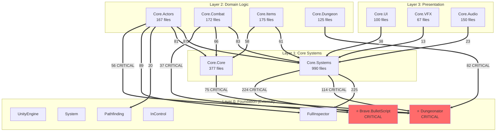

# Module Dependency Graph

**Generated by:** analyze_module_dependencies.py
**Enhanced with:** Manual curation and architectural analysis

---

## Architectural Overview

The ETG codebase follows a **layered architecture** with clear dependency flow:

**Foundation (Layer 0)** → **Core Systems (Layer 1)** → **Domain Logic (Layer 2)** → **Presentation (Layer 3)**

**Key Principle:** Dependencies flow downward - higher layers depend on lower layers, never the reverse.

---

## Layer Descriptions

### Layer 0: Foundation (External Dependencies)
**Purpose:** Provides fundamental capabilities that all game logic builds upon
- **UnityEngine:** Game engine API (rendering, physics, transforms)
- **System:** .NET Base Class Library (collections, I/O, threading)
- **Dungeonator:** ⭐ CRITICAL - Spatial/dungeon framework (most depended upon)
- **Brave.BulletScript:** ⭐ CRITICAL - Boss bullet pattern DSL
- **FullInspector:** Serialization framework (can be replaced)
- **InControl:** Input management (can be replaced)
- **Pathfinding:** A* navigation library (can be replaced)

### Layer 1: Core Systems
**Purpose:** Infrastructure and framework code
- **Core.Systems:** Game managers, data persistence, utilities (990 files - largest)
- **Core.Core:** Base classes (GameActor, AIActor), enums, interfaces (377 files)

**Note:** These modules have the highest outgoing dependencies and serve as the glue between foundation and game logic.

### Layer 2: Domain Logic
**Purpose:** Game mechanics and business logic
- **Core.Actors:** Player, enemies, NPCs, AI behaviors (167 files)
- **Core.Combat:** Projectiles, damage, effects (172 files)
- **Core.Items:** Guns, active/passive items, pickups (175 files)
- **Core.Dungeon:** Room controllers, interactables (125 files)

**Note:** These modules implement the core gameplay. Tightly coupled to each other but isolated from presentation.

### Layer 3: Presentation
**Purpose:** User interface, audio, visual effects
- **Core.UI:** HUD, menus, Ammonomicon (100 files)
- **Core.Audio:** Sound management, Wwise integration (150 files)
- **Core.VFX:** Visual effects, particles (67 files)

**Note:** Most isolated layer - can be migrated last with minimal impact.

---

## Architecture Layers



---

## Critical Integration Points

### Dungeonator Integration (419 total file dependencies)
**Why Critical:** Provides spatial context for entire game

**Major Consumers:**
- Core.Systems: 114 files (spatial queries, room management)
- Core.Dungeon: 82 files (room logic directly depends on Dungeon)
- Core.Core: 75 files (framework-level spatial queries)
- Core.Actors: 56 files (AI navigation, actor placement)
- Core.Items: 41 files (item spawning and placement)
- Core.Combat: 22 files (projectile-dungeon collision)

**Migration Strategy:**
- Option A: Port entire Dungeonator module as-is (cleanly separated namespace)
- Option B: Create adapter layer to new spatial system
- Option C: Replace with equivalent procedural generation library

---

### Brave.BulletScript Integration (268 total file dependencies)
**Why Critical:** Boss bullet patterns define game's challenge

**Major Consumers:**
- Core.Systems: 224 files (bullet pattern definitions stored as data)
- Core.Combat: 37 files (pattern execution and choreography)
- Core.Core: 6 files (framework integration)

**Migration Strategy:**
- MUST PORT: Boss fights require these complex patterns
- Alternative: Rewrite all boss patterns in native code (extremely time-consuming)
- Recommendation: Port Brave.BulletScript framework intact

---

### FullInspector Integration (343 total file dependencies)
**Why Medium Priority:** Serialization framework, can be replaced

**Major Consumers:**
- Core.Systems: 225 files (data serialization)
- Core.Actors: 89 files (behavior tree serialization)
- Core.Combat: 30 files (projectile config serialization)

**Migration Strategy:**
- CAN REPLACE: Use Unity JsonUtility or Newtonsoft.Json
- Refactoring Required: Update serialization attributes
- Medium effort, but not blocking

---

## Circular Dependencies

**3 bidirectional dependencies detected (all involving Dungeonator):**

1. **Dungeonator ↔ HutongGames.PlayMaker**
   - Expected: PlayMaker uses dungeon context, Dungeon fires PlayMaker events
   - Migration: Break by removing PlayMaker (visual scripting not essential)

2. **Dungeonator ↔ Pathfinding**
   - Expected: Tight pathfinding integration with spatial system
   - Migration: Keep as coupled pair

3. **Dungeonator ↔ tk2dRuntime**
   - Expected: Rendering integration with dungeon tiles
   - Migration: Replace tk2dRuntime with native 2D rendering

**Note:** None of these circular dependencies are problematic - they represent intentional bidirectional integration.

---

## Dependency Flow Summary

**Downward Flow (Correct):**
```
Presentation → Domain → Core → Foundation
(Layer 3)    (Layer 2) (Layer 1) (Layer 0)
```

**No Upward Dependencies:** Foundation does not depend on Domain logic ✅
**No Cross-Layer Skipping:** Each layer only depends on adjacent lower layer ✅

---

## Migration Dependency Order

### Phase 1: Foundation
1. Core.Core (framework base classes)
2. Dungeonator (spatial system)
3. Brave.BulletScript (bullet patterns)

### Phase 2: Core + Domain
4. Core.Systems (split into subsystems)
5. Core.Combat (projectiles, damage)
6. Core.Actors (player, enemies)
7. Core.Items (inventory)
8. Core.Dungeon (room logic)

### Phase 3: Presentation
9. Core.UI (interface)
10. Core.Audio (sound)
11. Core.VFX (effects)

### Phase 4: Dependencies
12. Replace FullInspector → Standard serialization
13. Replace InControl → New input system
14. Replace tk2dRuntime → Native 2D rendering
15. Remove HutongGames.PlayMaker → Code behaviors directly

---

## Legend

- **Solid arrows (-->)**: Standard dependencies
- **Thick arrows (==>)**: Heavy dependencies (>50 files)
- **Numbers on arrows**: Count of files with dependency
- **⭐ CRITICAL**: Must port - essential for game functionality
- **Red nodes**: Critical external dependencies

---


