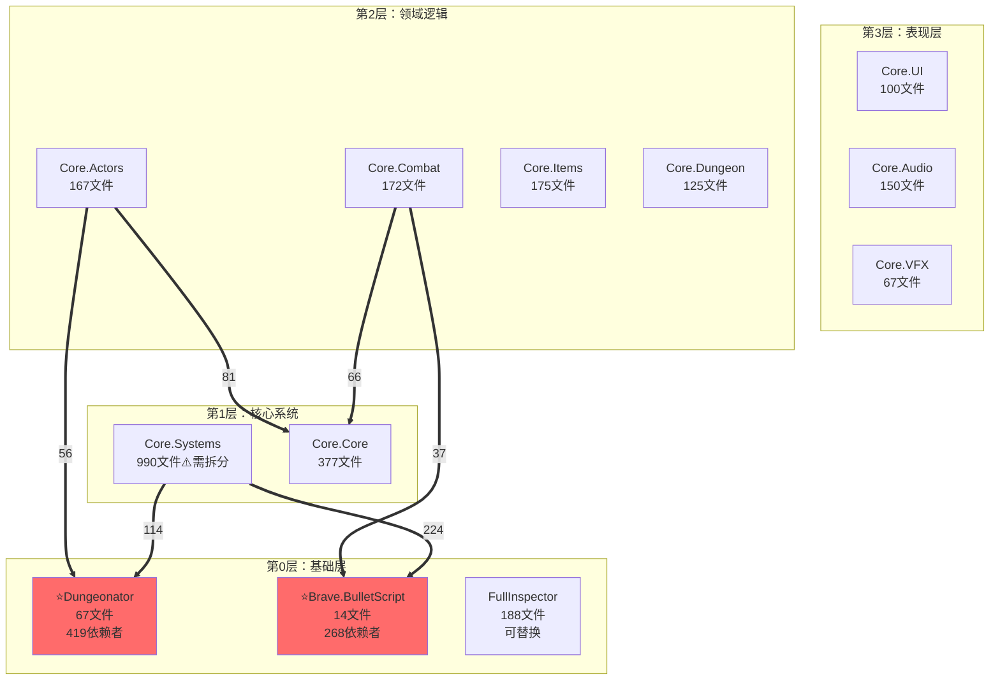

# Task-07 工作记忆文档

**创建时间：** 2026-01-18
**状态：** 进行中 - 准备创建Architecture_Analysis.md
**目的：** 保存当前工作状态，供新Agent继续执行

---

## 当前任务概述

### Task-07目标
创建**Architecture_Analysis.md**（中文架构分析文档），综合Task-06的所有架构发现。

### 任务状态
- ✅ Task-06已完成（所有模块边界和依赖分析）
- ✅ 进入Plan Mode，设计了Task-07执行计划
- ✅ Plan已获用户批准
- ✅ 启动Explore代理，完成架构分析总结
- ⚠️ 启动general-purpose代理创建文档，但超出token限制
- 🔄 **当前状态：** 准备手动分步创建Architecture_Analysis.md

### 待办事项状态
```
✅ Step 1: 准备工作（数据收集） - 已完成
🔄 Step 2: 创建文档框架 - 进行中
⏸️ Step 3: 编写第一部分（概览）
⏸️ Step 4: 编写第二部分（架构分层）
⏸️ Step 5: 编写第三部分（设计模式）
⏸️ Step 6: 编写第四部分（技术决策）
⏸️ Step 7-12: 编写剩余部分
⏸️ Step 13: 审查和完善
⏸️ Step 14: Git提交
```

---

## Task-06完成情况（基础数据）

### 已创建的文档
Task-06已成功完成所有核心文档：

**主要文档（Docs/）：**
1. ✅ `module_definitions.yaml` - 22个模块定义
2. ✅ `dependency_analysis.json` - 机器可读依赖数据（85个依赖关系）
3. ✅ `Module_Manifest.md` - 完整模块目录（22个模块，~22KB）
4. ✅ `Module_Dependency_Matrix.md` - 依赖矩阵表格
5. ✅ `Module_Dependency_Graph.md` - Mermaid可视化依赖图
6. ✅ `Module_Boundaries.md` - 中央索引文档

**嵌入式边界文档（MODULE_BOUNDARY.md）：**
- ✅ `Assets/Scripts/ETG/Dungeonator/MODULE_BOUNDARY.md`
- ✅ `Assets/Scripts/ETG/Brave/MODULE_BOUNDARY.md`
- ✅ `Assets/Scripts/ETG/Core/Systems/MODULE_BOUNDARY.md`
- ✅ `Assets/Scripts/ETG/Core/Core/MODULE_BOUNDARY.md`
- ✅ `Assets/Scripts/ETG/Core/Actors/MODULE_BOUNDARY.md`
- ✅ `Assets/Scripts/ETG/Core/Combat/MODULE_BOUNDARY.md`
- ✅ `Assets/Scripts/ETG/Core/Items/MODULE_BOUNDARY.md`
- ✅ `Assets/Scripts/ETG/Core/Dungeon/MODULE_BOUNDARY.md`

**分析工具：**
- ✅ `Tools/analyze_module_dependencies.py` - Python依赖分析脚本

---

## 关键架构发现（来自Explore代理）

### 1. 四层架构设计

**Layer 0: 基础层（Foundation）**
- 13个外部模块
- **Dungeonator**: 67文件，419个依赖者（最关键）
- **Brave.BulletScript**: 14文件，268个依赖者
- **FullInspector**: 188文件，343个依赖者（可替换）

**Layer 1: 核心系统（Core Systems）**
- 2个核心模块
- **Core.Systems**: 990文件（最大模块，需拆分）
- **Core.Core**: 377文件，265个依赖者

**Layer 2: 领域逻辑（Domain Logic）**
- 4个领域模块
- **Core.Actors**: 167文件，137个依赖者
- **Core.Combat**: 172文件，72个依赖者
- **Core.Items**: 175文件，35个依赖者
- **Core.Dungeon**: 125文件，7个依赖者

**Layer 3: 表现层（Presentation）**
- 3个表现模块
- **Core.UI**: 100文件
- **Core.Audio**: 150文件
- **Core.VFX**: 67文件

**验证结果：**
- ✅ 依赖方向正确（高层→低层）
- ✅ 无向上依赖
- ✅ 无跨层跳跃
- ⚠️ 仅3个循环依赖（都在预期内，可接受）

### 2. 设计模式清单（14种）

**Foundation层模式：**
- Facade Pattern（Dungeonator.Dungeon）
- Builder Pattern（TK2DDungeonAssembler）
- Interpreter Pattern（Brave.BulletScript DSL）
- Object Pool Pattern（Bullet管理）

**Core层模式：**
- Singleton Pattern（GameManager, SaveManager）
- Service Locator Pattern（管理器访问）
- Template Method Pattern（GameActor, AIActor）
- Wrapper Pattern（SpeculativeRigidbody）

**Domain层模式：**
- Component Pattern（Actor behaviors）
- Behavior Tree Pattern（AI系统）
- State Machine Pattern（Actor/Room states）
- Strategy Pattern（Projectile/Item behaviors）
- Decorator Pattern（Projectile modifiers）
- Factory Pattern（Spawning系统）
- Composite Pattern（Item synergies）

**Presentation层模式：**
- Observer Pattern（UI updates）
- Mediator Pattern（Audio/VFX管理）

### 3. 关键技术决策（6个ADR）

**ADR-001: Core.Systems拆分策略**
- 问题：990文件单一模块，违反SRP
- 决策：拆分为Core.Data、Core.Management、Core.Utilities
- 影响：380个文件需更新using语句

**ADR-002: Dungeonator完整移植决策**
- 问题：419个依赖，是否移植
- 决策：完整移植（Option A）
- 理由：无可替代方案，定制化高

**ADR-003: Brave.BulletScript保留决策**
- 问题：268个依赖，Boss模式
- 决策：必须完整移植
- 理由：不可替换，Boss战斗核心

**ADR-004: FullInspector替换策略**
- 问题：343个依赖用于序列化
- 决策：替换为标准JSON
- 理由：可替换，降低复杂度

**ADR-005: 自定义物理系统处理**
- 问题：SpeculativeRigidbody物理包装
- 决策：完整移植，保持行为一致
- 理由：游戏手感核心

**ADR-006: 循环依赖处理方案**
- 问题：3个循环依赖
- 决策：保持Dungeonator↔Pathfinding，移除PlayMaker，替换tk2dRuntime
- 理由：都在预期内

### 4. 依赖关系统计

**关键依赖路径：**
- Dungeonator → 419个依赖者（Core.Systems 114, Core.Dungeon 82, Core.Core 75...）
- Brave.BulletScript → 268个依赖者（Core.Systems 224, Core.Combat 37...）
- Core.Core → 265个依赖者（所有Domain层模块）
- FullInspector → 343个依赖者（可替换）

**循环依赖（3个）：**
1. Dungeonator ↔ PlayMaker（1↔12文件） - 可移除PlayMaker
2. Dungeonator ↔ Pathfinding（2↔2文件） - 保持耦合
3. Dungeonator ↔ tk2dRuntime（1↔3文件） - 替换tk2dRuntime

**依赖强度分类：**
- Strong (>50 files): Dungeonator, Brave.BulletScript, Core.Core - 不可替换
- Medium (10-50 files): FullInspector, InControl - 可重构
- Weak (<10 files): 其他外部库 - 易替换

### 5. 迁移策略框架

**阶段1: 基础层（Phase 1）**
1. Core.Core（377文件）- 框架基类
2. Dungeonator（67文件）- 空间系统
3. Brave.BulletScript（14文件）- 弹幕DSL

**阶段2: 核心+领域（Phase 2）**
4. Core.Systems（990文件，先拆分）
5. Core.Combat（172文件）
6. Core.Actors（167文件）
7. Core.Items（175文件）
8. Core.Dungeon（125文件）

**阶段3: 表现层（Phase 3）**
9. Core.UI（100文件）
10. Core.Audio（150文件）
11. Core.VFX（67文件）

**阶段4: 外部依赖替换（Phase 4）**
12. FullInspector → Standard JSON
13. InControl → New Input System
14. tk2dRuntime → Native 2D
15. PlayMaker → Remove

### 6. 风险评估矩阵

**极高风险模块：**
- Core.Core（265依赖者）- 基类变更级联影响
- Core.Systems（990文件）- 最大模块
- Core.Combat（弹幕物理）- 游戏手感
- Dungeonator（419依赖者）- 空间基础

**高风险模块：**
- Brave.BulletScript - Boss战斗核心
- Core.Actors - 玩法手感

**中风险模块：**
- Core.Items - 数据驱动为主
- Core.Dungeon - 状态机复杂

**低风险模块：**
- Presentation层（UI, Audio, VFX）- 相对隔离

### 7. 性能关键路径

**Hotpath代码：**
- GameActor.Update()（100+ actors/frame）
- SpeculativeRigidbody.PhysicsUpdate()（每actor每帧）
- PixelCollider.Query()（碰撞检测）
- Projectile.Update()（200+ projectiles）
- BulletScript.Execute()（弹幕执行）

**性能要求：**
- 目标帧率：60 FPS
- Actor更新：<0.1ms/actor
- 碰撞查询：<0.05ms/query
- GC分配：零（稳态）

---

## Architecture_Analysis.md 文档结构

### 文档规格
- **路径：** `Docs/Architecture_Analysis.md`
- **语言：** 简体中文
- **预期长度：** 8,000-12,000行
- **文件大小：** 60-100 KB
- **Mermaid图表：** 3-5个（中文标注）
- **表格：** 15-20个

### 10个主要部分

#### 第一部分：概览
**内容：**
- 文档元信息（生成日期、版本、数据来源）
- 执行摘要（3-5段，架构总览）
- 关键发现（7个要点）
- 代码库统计（表格）

**数据来源：**
- Module_Manifest.md
- dependency_analysis.json
- 探索代理总结

**预计字数：** 800-1,200行

#### 第二部分：架构分层与模块组织
**内容：**
- 四层架构详解（每层职责、包含模块）
- Mermaid架构图（中文标注，4层分组）
- 依赖流向分析
- 模块职责矩阵表格

**数据来源：**
- Module_Dependency_Graph.md
- Module_Manifest.md

**预计字数：** 1,000-1,500行

#### 第三部分：设计模式识别
**内容：**
- 按模块分类的设计模式（14种）
- 模式使用频率统计（表格）
- 架构模式分析（分层架构、事件驱动）

**数据来源：**
- 8个MODULE_BOUNDARY.md的Architectural Notes部分

**预计字数：** 800-1,200行

#### 第四部分：关键技术决策
**内容：**
- 6个ADR记录（标准ADR格式）
  - ADR-001: Core.Systems拆分
  - ADR-002: Dungeonator移植
  - ADR-003: BulletScript保留
  - ADR-004: FullInspector替换
  - ADR-005: 物理系统处理
  - ADR-006: 循环依赖处理
- 技术栈分析（Unity依赖、外部库分类）

**数据来源：**
- MODULE_BOUNDARY.md的Migration Guidance
- 探索代理的技术决策总结

**预计字数：** 2,000-3,000行

#### 第五部分：依赖关系深度分析
**内容：**
- 关键依赖路径（Dungeonator 419, BulletScript 268, Core.Core 265）
- 循环依赖分析（3个详解）
- 依赖强度分类表格

**数据来源：**
- Module_Dependency_Matrix.md
- dependency_analysis.json

**预计字数：** 800-1,200行

#### 第六部分：迁移策略与路线图
**内容：**
- 四阶段迁移计划（详细描述）
- 迁移决策树（Mermaid流程图，中文）
- 11步迁移序列（详细步骤、依赖、并行机会）

**数据来源：**
- Module_Boundaries.md的Decision Tree
- MODULE_BOUNDARY.md的Migration Strategy

**预计字数：** 1,500-2,000行

#### 第七部分：风险评估与缓解
**内容：**
- 风险分级定义（4个级别）
- 22个模块风险矩阵表格
- 关键风险点和缓解策略

**数据来源：**
- MODULE_BOUNDARY.md的Risk Assessment

**预计字数：** 800-1,200行

#### 第八部分：性能关键路径
**内容：**
- Hotpath代码清单
- 性能要求规格表
- 性能测试计划

**数据来源：**
- MODULE_BOUNDARY.md的Performance Considerations

**预计字数：** 500-800行

#### 第九部分：数据迁移考虑
**内容：**
- 序列化格式变更计划（FullInspector → JSON）
- 数据完整性清单（枪械、物品、弹幕、AI配置）

**数据来源：**
- MODULE_BOUNDARY.md的Data Migration

**预计字数：** 500-800行

#### 第十部分：建议与后续步骤
**内容：**
- 立即行动项（3-5条）
- 中期计划（3-5条）
- 长期愿景

**预计字数：** 300-500行

---

## 下一步行动指南

### 立即执行步骤

#### Step 2: 创建文档框架（30分钟）
```bash
# 创建文件
touch Docs/Architecture_Analysis.md

# 写入框架：
1. 文档标题和元信息
2. 目录（10个部分链接）
3. 10个部分的一级标题和二级标题
```

#### Step 3: 编写第一部分 - 概览（1小时）
**包含内容：**
- 执行摘要（架构描述、4层概述、关键发现7条）
- 代码库统计表格（总文件数、模块数、依赖数等）
- 按层统计表格（Layer 0-3的模块数、文件数）

**关键数据：**
- 总文件数：4,047
- 总模块数：22
- 依赖关系数：85
- 循环依赖数：3
- 最大模块：Core.Systems（990文件）
- 最关键模块：Dungeonator（419依赖者）

#### Step 4: 编写第二部分 - 架构分层（1.5小时）
**包含内容：**
- 四层架构详细描述（每层职责、模块列表）
- Mermaid架构图（带中文标注）
- 模块职责矩阵表格

**Mermaid图示例：**


#### Step 5-12: 编写剩余部分（6-8小时）
按顺序编写第3-10部分，每部分参考上述内容结构。

#### Step 13: 审查和完善（1小时）
**检查清单：**
- [ ] 所有10个部分完整
- [ ] 数据与Task-06一致
- [ ] 中文表达流畅
- [ ] Mermaid图可渲染
- [ ] 表格格式正确
- [ ] 目录链接有效
- [ ] 无拼写错误

#### Step 14: Git提交（10分钟）
```bash
git add Docs/Architecture_Analysis.md
git commit -m "[Task-07] 完成架构分析文档（中文版）

完成Task-07：创建Architecture_Analysis.md综合架构分析文档

内容：
- 10个主要部分（概览、分层、模式、决策、依赖、迁移、风险、性能、数据、建议）
- 6个ADR记录（架构决策记录）
- 15-20个表格
- 3-5个Mermaid图表
- 8,000+行中文内容

基于Task-06数据：
- 22个模块分析
- 85个依赖关系
- 8个MODULE_BOUNDARY.md
- 14种设计模式识别

Co-Authored-By: Claude Sonnet 4.5 <noreply@anthropic.com>"
```

---

## 关键文件路径

### Task-06输入文件
```
D:\Github\Re-ETG\Docs\Module_Manifest.md
D:\Github\Re-ETG\Docs\Module_Dependency_Matrix.md
D:\Github\Re-ETG\Docs\Module_Dependency_Graph.md
D:\Github\Re-ETG\Docs\Module_Boundaries.md
D:\Github\Re-ETG\Docs\dependency_analysis.json
D:\Github\Re-ETG\Assets\Scripts\ETG\Dungeonator\MODULE_BOUNDARY.md
D:\Github\Re-ETG\Assets\Scripts\ETG\Brave\MODULE_BOUNDARY.md
D:\Github\Re-ETG\Assets\Scripts\ETG\Core\Systems\MODULE_BOUNDARY.md
D:\Github\Re-ETG\Assets\Scripts\ETG\Core\Core\MODULE_BOUNDARY.md
D:\Github\Re-ETG\Assets\Scripts\ETG\Core\Actors\MODULE_BOUNDARY.md
D:\Github\Re-ETG\Assets\Scripts\ETG\Core\Combat\MODULE_BOUNDARY.md
D:\Github\Re-ETG\Assets\Scripts\ETG\Core\Items\MODULE_BOUNDARY.md
D:\Github\Re-ETG\Assets\Scripts\ETG\Core\Dungeon\MODULE_BOUNDARY.md
```

### Task-07输出文件
```
D:\Github\Re-ETG\Docs\Architecture_Analysis.md  # 待创建
```

### 计划文件
```
C:\Users\CountZero\.claude\plans\expressive-greeting-karp.md  # Task-07计划
```

---

## 注意事项

### 1. 中文表达要求
- 使用简体中文
- 技术术语保持英文（如Facade, Builder）
- 模块名保持英文（如Core.Systems）
- Mermaid图标注使用中文

### 2. 数据准确性
- 所有数字必须来自Task-06文档
- 模块文件数、依赖者数要准确
- 不要编造数据

### 3. ADR格式规范
每个ADR包含：
- 状态（建议中/已确认）
- 决策日期
- 问题陈述
- 决策内容
- 理由和权衡
- 影响范围
- 实施计划
- 替代方案
- 相关决策

### 4. Mermaid图表要求
- 使用中文标注
- 显示关键依赖（粗箭头 ==>）
- 标注关键模块（红色 fill:#ff6b6b）
- 分层分组清晰

### 5. 表格格式
使用Markdown表格：
```markdown
| 列1 | 列2 | 列3 |
|-----|-----|-----|
| 数据1 | 数据2 | 数据3 |
```

---

## 预计工作量

**总预计时间：** 12-14小时

**分解：**
- Step 2: 文档框架 - 30分钟
- Step 3: 第一部分 - 1小时
- Step 4: 第二部分 - 1.5小时
- Step 5: 第三部分 - 1小时
- Step 6: 第四部分 - 1.5小时
- Step 7: 第五部分 - 1小时
- Step 8: 第六部分 - 2小时
- Step 9: 第七部分 - 1小时
- Step 10: 第八部分 - 45分钟
- Step 11: 第九部分 - 45分钟
- Step 12: 第十部分 - 30分钟
- Step 13: 审查完善 - 1小时
- Step 14: Git提交 - 10分钟

---

## 成功标准

### 文档完整性
- ✅ 包含所有10个部分
- ✅ 每部分内容充实（符合预计字数）
- ✅ 所有表格数据完整
- ✅ 所有Mermaid图表可渲染

### 内容质量
- ✅ 数据来源于Task-06（可追溯）
- ✅ 架构分析准确深入
- ✅ 设计模式识别正确
- ✅ 迁移策略可行
- ✅ 风险评估合理

### 中文表达
- ✅ 简体中文撰写
- ✅ 技术术语准确
- ✅ 表达清晰流畅
- ✅ 适合目标读者（架构师、开发团队）

### 可用性
- ✅ 目录完整可导航
- ✅ 章节链接有效
- ✅ 表格可读性好
- ✅ Mermaid图有中文标注

---

## Git提交历史参考

**Task-06的7个提交：**
```
e2cd64ca [Task-06] Step 7: Create Module_Boundaries.md central index
6e7f8f5b [Task-06] Step 6 Part 3: Create MODULE_BOUNDARY.md for Core.Core
29a5ac18 [Task-06] Step 6 Part 2: Create MODULE_BOUNDARY.md for Domain layer
0c250583 [Task-06] Step 6 Part 1: Create MODULE_BOUNDARY.md for critical modules
01de8b9b [Task-06] Step 5: Enhance dependency matrix and graph
d29e4cc0 [Task-06] Step 4: Create comprehensive Module_Manifest.md
68bfa64f [Task-06] Steps 1-3: Module definitions and automated dependency analysis
```

**Task-07预期提交：**
```
[Task-07] 完成架构分析文档（中文版）
```

---

## 当前会话上下文

**Plan文件路径：**
```
C:\Users\CountZero\.claude\plans\expressive-greeting-karp.md
```

**Agent ID（可恢复）：**
- 探索代理：a7cb400（架构分析总结已完成）
- 通用代理：ae56042（创建文档时超token限制，可继续）

**工作目录：**
```
D:\Github\Re-ETG
```

**Git分支：**
```
main
```

---

## 结束语

这份工作记忆文档记录了Task-07的完整状态。新Agent可以基于此文档继续工作，按照Step 2-14的步骤创建Architecture_Analysis.md。

所有必要的数据和架构发现都已总结完毕，可以直接开始文档创建工作。

**建议新Agent的第一步行动：**
1. 读取此工作记忆文档
2. 读取Task-06的主要文档（Module_Manifest.md等）
3. 从Step 2开始，创建Architecture_Analysis.md框架
4. 逐步完成10个部分的内容编写

祝工作顺利！🚀
