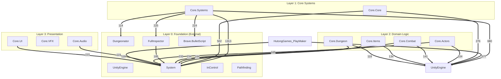

# Module Dependency Graph

**Generated by:** analyze_module_dependencies.py

## Architecture Layers

## Legend

- **Solid arrows (-->)**: Standard dependencies
- **Thick arrows (==>)**: Heavy dependencies (>50 files)
- **Numbers on arrows**: Count of files with dependency

